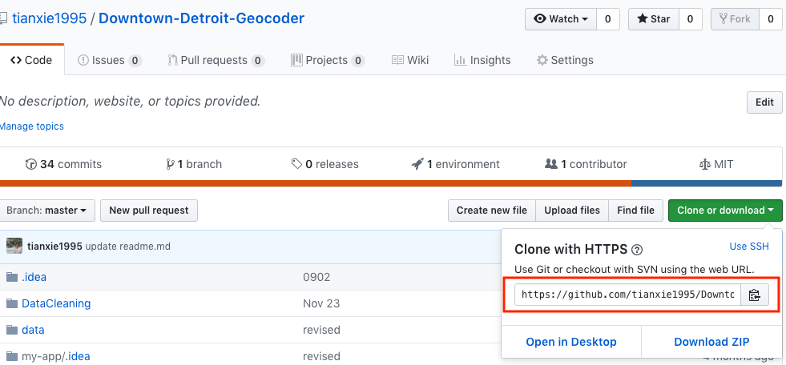

# [DDP](http://www.downtowndetroit.org) Projects Documentations

This is a all-in-one Tian's DDP Projects Documentation pages. The purpose of this page is to

1. Act like a Projects index in Github
2. Provide general solution for environment setting

## Projects Pages(By Time Series)

1. [Downtown Geocoder(tools)](https://github.com/downtowndetroit/ddp-geocoder)
2. [Downtown Business Inventory(Web Application)](https://downtowndetroit.github.io/business-inventory-app/)
3. [Development Viewer(Web Application)](https://downtowndetroit.github.io/business-inventory-app/development)
4. [Places API Scraper(tools)](https://github.com/downtowndetroit/google-places)
5. [Detroit Building Permit Automation Tools(tools)](https://github.com/downtowndetroit/building-permit)

## Environment Setting
### Install Git in computer

To clone the repository from Github, you need Git downloaded from [git](https://git-scm.com/downloads).

### Set up Python

Project 1,4 and 5 are writen with Python3. So the most important prerequesit is to have the right Python3 environment. I suggest to use `Anaconda` Python3 distribution. You can directly download from their [website](https://www.anaconda.com/).

### Install Required Packages

**Windows:**


In Windows, from the Start menu, search for and open “Anaconda Prompt”.

(If you already have anaconda installed and want to use a seperate environment to run these scripts, Create a new environment named `ddp` and type the following:)

```
conda create --name ddp
activate ddp
```

a. Install Packages required by specific srcipt, please refer to specific project pages

b. Run Scirpt

Within Anaconda Prompt, run

```
python SCRIPTNAME.PY
```

**MacOS or Linux**

All commands below are typed into the Terminal window.

(Create a new environment named `ddp` and activate it)

```
conda create --name ddp
source activate ddp
```

a. Install Packages required by specific srcipt, please refer to specific project pages

b. Run Scirpt

Within Anaconda Prompt, run

```
python SCRIPTNAME.PY
```

## Run script

After we set up the Anaconda environment, we can start running scripts.

**Windows** (_Runing in Anaconda Propmt_)

**Clone Repository**

choose the folder you want to put the repository in and clone it from Github

Find the repo link in Repo


```
cd FOLDER_ABOSOLUTE_PATH

git clone REPO_LINK
```

**Install packages and change configuration**

After clone the repository to your computer, we can start running the script

a. First, you need to change the current working direction to the repository by

```
cd REPO_FOLDER_NAME
```

b. Please read through each repository's README.md for requriement for each repo, change configuration, install required packages if needed

c. Run the script (this step depend on specific script's requirement)

```
python SCRIPT_NAME.py
```
## Reference 
Anaconda Documentation: https://conda.io/docs/user-guide/index.html

How-to-run-python-script-in-windows: https://medium.com/@tranngocminhcdn/running-python-scripts-by-using-anaconda-prompt-da2870d86fd0
